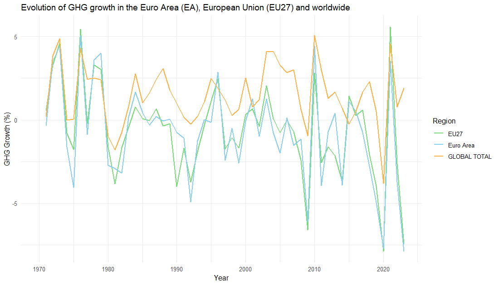
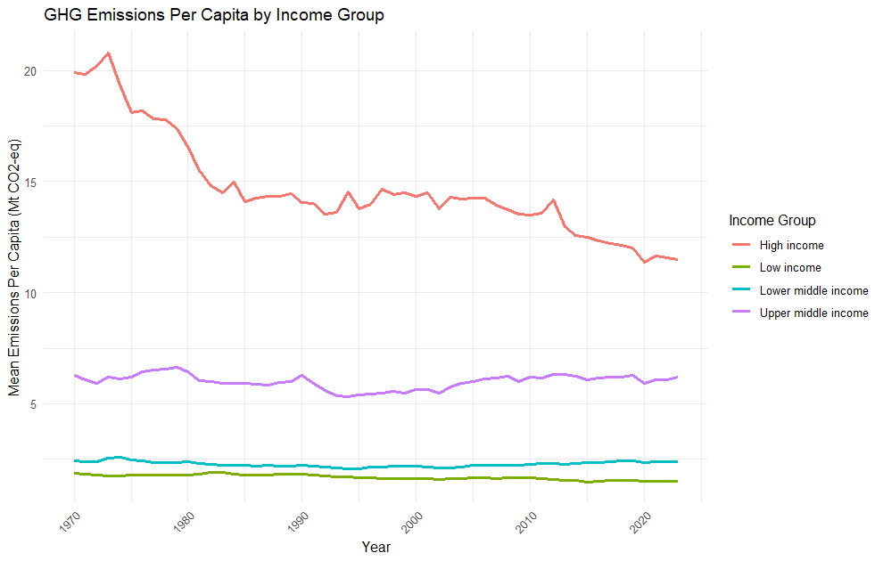
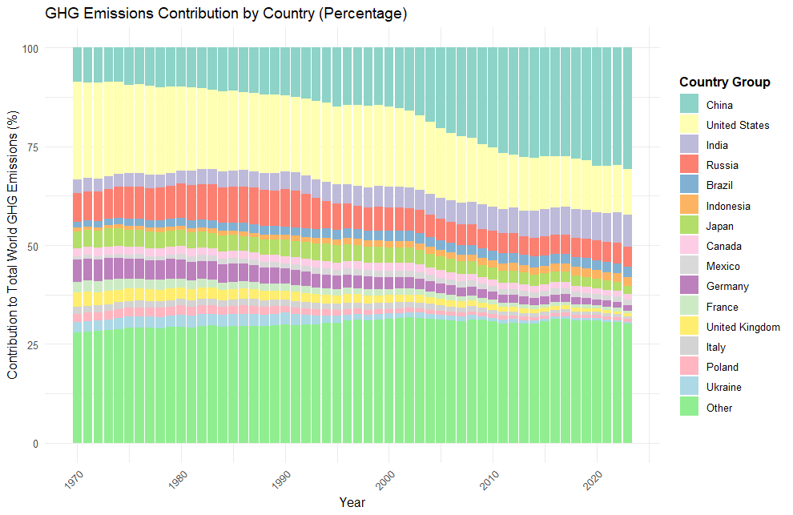
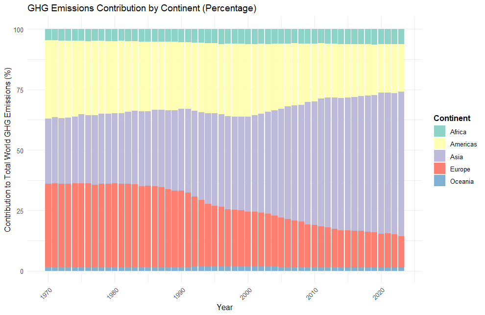

# Global Greenhouse Gas Emissions Analysis

## Overview

This project analyses global greenhouse gas (GHG) emissions using Global Atmospheric Research (EDGAR) data from the European Commission.

The analysis addresses:

1. Evolution of GHG emissions in the euro area, EU27 and worldwide.
2. Comparison of emissions per capita by World Bank income groups.
3. Contribution of countries and continents to global emissions.

## Data source

- EDGAR database: https://edgar.jrc.ec.europa.eu/
- The data on income groups used for Chart 2 is sourced from the [World Bank Country and Lending Groups](https://datahelpdesk.worldbank.org/knowledgebase/articles/906519-world-bank-country-and-lending-groups), ensuring consistent and reliable measurements of global greenhouse gas emissions.

## Methodology

The analysis includes:
- data cleaning and preparation;
- aggregation by geographical areas;
- calculation of per capita emissions;
- data visualisation and trend analysis.

## Results

### Chart 1 — Evolution of GHG emissions

Main findings:
- Over the observed period, the average growth rate of greenhouse gas (GHG) emissions in the European Union (EU) and Euro Area (EA) is negative, indicating decades-long decreasing trend in emissions. In contrast, global GHG emissions are on the rise. This suggests that these regions are making progress in reducing emissions intensity, potentially due to the adoption of climate policies and sustainable practices. However, the continued increase in global emissions highlights the uneven implementation or effectiveness of such measures across different regions.
- The EA demonstrates higher volatility in GHG emissions compared to the broader EU, while global emissions exhibit the least variability. This disparity reflects the degree of economic decoupling across countries, as national economies experience varied cycles of growth and contraction, leading to divergent emission patterns.
- The chart highlights a pro-cyclical trend in GHG emissions, with sharp declines during economic downturns — such as the COVID-19 pandemic, the Great Financial Crisis, the early 1990s recession, etc.. — followed by rapid recoveries. This underscores the strong link between economic activity and GHG emissions, reinforcing the importance of integrating climate considerations into economic policymaking to mitigate the environmental impact of economic cycles.

### Chart 2 — Emissions per capita by income group

Note: the data on income groups used for this analysis is sourced from the [World Bank Country and Lending Groups](https://datahelpdesk.worldbank.org/knowledgebase/articles/906519-world-bank-country-and-lending-groups), ensuring consistent and reliable measurements of global greenhouse gas emissions.

Main findings:
- Over the observed period, the greenhouse gas (GHG) emissions per capita show a strong positive correlation with income levels/groups. As an example, in 2023 high-income countries emitted approximately twice as much per capita as upper-middle-income countries, four times as much as lower-middle-income countries, and far more than low-income countries, which have the lowest emissions.
- Only high-income countries have achieved notable reductions in per capita emissions since 1970, dropping from approximately 20Mt CO2-eq per person to about 12 in 2023.
- Most reductions in high-income countries occurred between 1970 and 1985, after which emissions stabilized until 2012. Since then, there has been a gradual decline. It can also be observed that all income groups experienced noticeable reductions during the COVID-19 pandemic, though emissions have since rebounded to pre-pandemic levels.

### Chart 3 — Contribution to global emissions

Main findings:
- In 2023, the three largest emitters—China, the USA, and India—collectively accounted for 50% of global greenhouse gas emissions. The 12 other countries included in the graph contributed approximately 20%, while the remaining nations, grouped together for clarity, made up the remaining 30%.
- The United States, the largest emitter in 1970, has reduced its share of global emissions over time. However, this decline has been offset by a substantial increase in China’s share, with other countries showing less significant changes.
- Since 1970, Europe and the Americas have both seen declines in their shares of global emissions, with Europe dropping from around 30% to 12%, and the Americas from 35% to 18%. In contrast, Asia’s share has risen dramatically, growing from about 25% in 1970 to nearly 60% in 2022. Oceania and Africa’s shares remained constant over the period observed.
